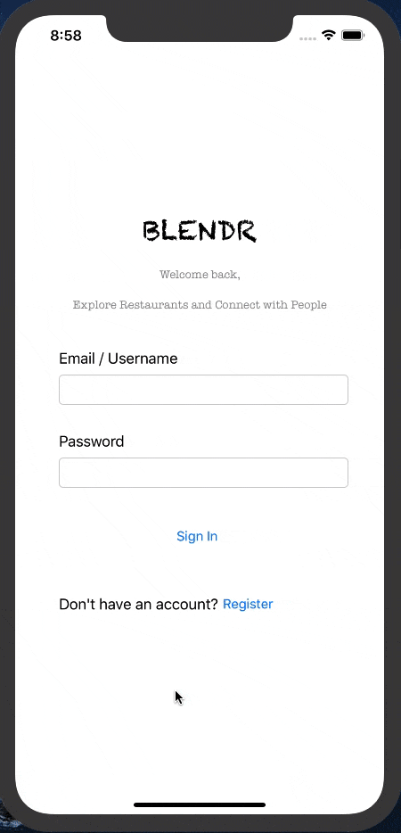

# BLENDR

## Table of Contents
1. [Overview](#Overview)
1. [Product Spec](#Product-Spec)
1. [Wireframes](#Wireframes)
2. [Schema](#Schema)
3. [Milestones](#Milestones)

## Overview
### Description
Blendr is an app that allows a user to view a feed of nearby restaurants and favorite them. The favorited restaurants will be sorted in a list. This list can be filtered depending on the type of food the user is hungry for. Users may also see reviews of other users and chat with them and may potentially become a food Tinder app.

### App Evaluation
- **Category:** Food 
- **Mobile:** The app would be developed for mobile users, but could potentially be used on a computer.
- **Story:** Gives user a feed of restaurants in the area. Allows user to favorite restaurants and look at reviews of other users too. Users can choose to chat with other reviewers to gain more insight about a particular restaurant too.
- **Market:** Any person could choose to use this app, especially those who have a difficult time deciding on where they/their group wants to eat. 
- **Habit:** This can be used as little or as often as somebody would like. 
- **Scope:** First we would start with allowing users to favorite restaurants, then it could evolve to a food-review app that allows reviewers to chat with each other. This app could have potential collaborations with UberEats in the future.

## Product Spec

### 1. User Stories (Required and Optional)

**Required Must-have Stories**

* User can register and log in.
* User can see a list of restaurants and favorite restaurants.
* User can see the list of restaurants favorited.
* User can update their profile.

**Optional Nice-to-have Stories**

* User can leave a review.
* User can add filter to restaurants.
* User can chat with another person who left a review.
* User can follow another user.
* User can look at the map view for restaurants.

### 2. Screen Archetypes

* Login/Register
   * User can register/login.
* Restaurants Stream (Home Screen)
   * User can see a list of restaurants and favorite restaurants.
* Favorites Stream (Favorite Tab)
   * User can see the list of restaurants favorited.
* Profile
   * User can update their profile.

Optional:
* Detailed Restaurants Stream
   * User can see details of a particular restaurant.
* Chat Screen
   * User can chat with another person who left a review.

### 3. Navigation

**Tab Navigation** (Tab to Screen)

* Home Tab
* Favorites Tab
* Profile Tab

Optional:
* Chat Tab
* Settings Tab

**Flow Navigation** (Screen to Screen)

* Log-in -> Directs to Home Tab
* Home Tab -> (Optional) Jumps to Detailed Restaurants.

## Wireframes


### [BONUS] Digital Wireframes & Mockups


### [BONUS] Interactive Prototype


## Schema 
### Models
#### Restaurants
   | Property      | Type     | Description |
   | ------------- | -------- | ------------|
   | restaurantId | Number | unique id for the restaurant |
   | restName | String | the name of the restaurant being shown |
   | miles    | Number   | number of miles away the restaurant is from the user |
   | restImage | File | the image of the restaurant in the feed |
   | category | String | the category of the restaurant |
   
#### Favorites
  | Property      | Type     | Description |
  | ------------- | -------- | ------------|
  | restaurantId | String | the name of the restaurant being shown |
  | user | Pointer to User | the person who favorited the restaurant |
  | favoritedOn     | DateTime | date when a restaurant is favorited |
  | restImage | File | the image of the restaurant in the feed |
  
#### Profile
  | Property      | Type     | Description |
  | ------------- | -------- | ------------|
  | user        | Pointer to User | the person who is using the app |
  | profilePic         | File     | image that user picks as their account photo |
  | email | String   | the email that the user uses to log in with |
  | joinedOn    | DateTime | date when user makes their account |
  
#### Reviews
  | Property      | Type     | Description |
  | ------------- | -------- | ------------|
  | reviewId      | String   | unique id for the review |
  | user | Pointer to User | the person who made the review |
  | caption       | String   | caption by  the author |
  | rating | Number | rating given by user from a scale of 1-5 |

### Networking
#### List of network requests by screen
   - Login Screen
      - (Read/GET) Allow user to login
        ```swift
        @IBAction func onLogin(_ sender: Any) {
            let username = usernameField.text!
            let password = passwordField.text!
            
            PFUser.logInWithUsername(inBackground: username, password: password) {(user, error) in
                if user != nil {
                    print("Successfully logged in user.")
                    self.performSegue(withIdentifier: "loginSegue", sender: nil) 
                } else {
                    print(error.localizedDescription)
                }
            }
        }
        ```
   - Register Screen
      - (Create/POST) Register new user
         ```swift
         @IBAction func onRegister(_ sender: Any) {
             let user = PFUser()
             user.username = usernameField.text
             user.email = emailField.text
             user.password = passwordField.text
             
             user.SignUpInBackground { (success, error) in
                 if success {
                     print("Successfully registered user.")
                     self.performSegue(withIdentifier: "loginSegue", sender: nil)
                 } else {
                     print(error.localizedDescription)
                 }
             }
         }
         ```
   - Home Feed Screen
      - (Read/GET) Query all posts where user views a list of restaurants
        ```swift
         let query = PFQuery(className:"Restaurant")
         query.findObjectsInBackground { (restaurants: [PFObject]?, error: Error?) in
            if let error = error { 
               print(error.localizedDescription)
            } else if let restaurants = restaurants {
               print("Successfully retrieved \(restaurants.count) restaurants.")
            }
         }
         ```
      - (Create/POST) Create a new like(favorite) on a restaurant.
        ```swift
        let restaurantArray = [NSDictionary]()
        
        @IBAction func onFavorite (_ sender: Any) {
            let favorite = PFObject(className: "Favorites")
            favorite["restaurantId"] = restaurantArray[indexPath.row]["restaurantId"]
            favorite["user"] = PFUser.current()!
            favorite["favoritedOn"] = Date()
            favorite["restImage"] = restaurantArray[indexPath.row]["restImage"]
            
            favorite.saveInBackground {(success, error) in
                if (success) {
                    print("Successfully favorited restaurant.") 
                } else {
                    print(error.localizedDescription)
                }
            
        }
        ```
   - Favorites Screen
      - (Read/GET) Query all restaurants user favorited
        ```swift
         let query = PFQuery(className:"Favorites")
         query.whereKey("user", equalTo: currentUser)
         query.order(byDescending: "favoritedAt")
         query.findObjectsInBackground { (favorites: [PFObject]?, error: Error?) in
            if let error = error { 
               print(error.localizedDescription)
            } else if let favorites = favorites {
               print("Successfully retrieved \(favorites.count) favorites.")
            }
         }
         ```
      - (Delete) Delete a favorited restaurant
        ```swift
        let restaurantArray = [NSDictionary]()
        
        @IBAction func onUnfavorite (_ sender: Any) {
            restaurant = restaurantArray[indexPath.row]["restaurantId"]
            let query = PFQuery(className: "Favorites")
            query.whereKey("user", equalTo: currentUser)
            query.whereKey("restaurantId", equalTo: restaurant)
            query.findObjectsInBackground { (favorite: [PFObject]?, error: Error?) in
                if let error = error {
                    print(error.localizedDescription)
                } else if let favorite = favorite {
                    favorite.deleteInBackground()
                    print("Successfully deleted favorite.")
                }    
            }
        }
        ```
   - Profile Screen
      - (Read/GET) Query logged in user object
        ```swift
         let query = PFQuery(className:"Profile")
         query.whereKey("user", equalTo: currentUser)
         query.findObjectsInBackground { (user: [PFObject]?, error: Error?) in
            if let error = error { 
               print(error.localizedDescription)
            } else if let user = user {
               print("Successfully retrieved user \(user).")
            }
         }
         ```
     - (Update/PUT) Update user profile image
        ```swift
        let query = PFQuery(className:"Profile")
        query.getObjectInBackground(withId: PFUser.current()!) {(profile: PFObject?, error: Error?) in
            if let error = error {
                print(error.localizedDescription)
            } else if let profile = profile {
                let imageData = imageView.image!.pngData()
                profile["profilePic"] = PFFileObject(name: "image.png", data: imageData!)
                profile.saveInBackground()
            }
        }
        ```
#### [OPTIONAL:] Existing API Endpoints
##### Yelp API
- Base URL - [https://api.yelp.com/v3](https://api.yelp.com/v3)

   HTTP Verb | Endpoint | Description
   ----------|----------|------------
    `GET`    | /businesses | gets all businesses/restaurants
    `GET`    | /businesses/search?location=location | return businesses in the specific location


##### Google Maps API
- Base URL - [https://maps.googleapis.com/maps/api/place/nearbysearch](https://maps.googleapis.com/maps/api/place/nearbysearch)

   HTTP Verb | Endpoint | Description
   ----------|----------|------------
    `GET`    | /json?types=restaurant | gets all nearby restaurants

## Milestones
### Milestone 1
#### User Stories
- [x] User sees an app icon on the home screen and a styled launch screen
- [x] User can register, login, and logout.
- [x] User can see their credentials and add a profile picture on the profile screen.
- [x] User sees a list of restaurants on the home screen.

#### Other Features
- [x] Setup Parse server
- [x] Setup API

#### App Walkthrough GIF

<br>
 
### Milestone 2
#### User Stories
- [x] User can see a detailed view when tapping on a restaurant.
- [x] User can favorite a restaurant.
- [x] User can see the list of restaurants they've favorited.
- [x] User can add a review and see other reviews.
- [x] User can see a map of where the restaurant is located.

#### App Walkthrough GIF

<br>

### Milestone 3
#### User Stories
- [x] User gets an alert message when entering an incorrect password, creating account that already exists, or when there are empty fields.
- [x] User can only favorite a restaurant once.
- [x] User can see their profile picture saved.

#### Other Features
- [x] Setup/cleaned constraints.
- [x] Cleaned code.


#### App Walkthrough GIF

<br>
